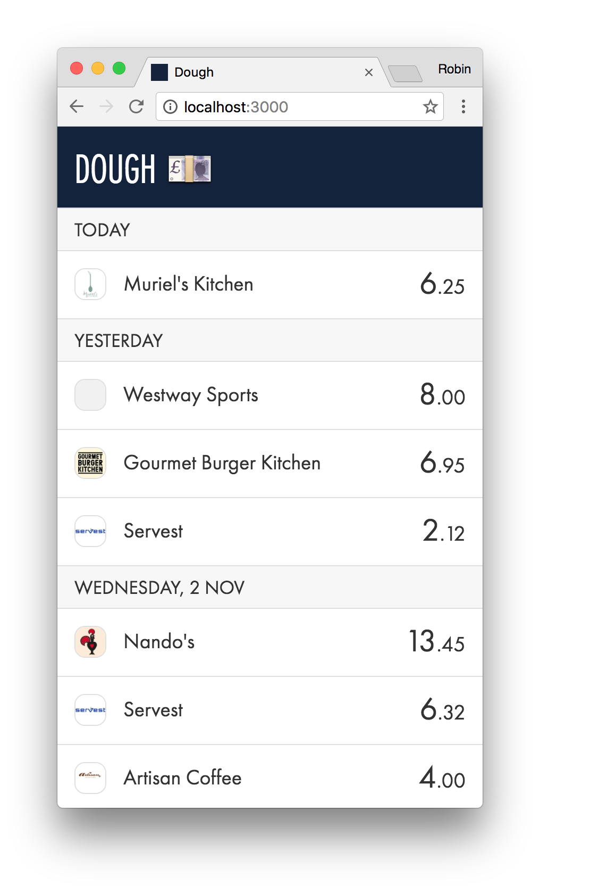

# dough

> A web application for [Monzo](https://monzo.com/)

This is very much a _work in progress_ 🚧. I'm using this application to practice React and Redux. It currently supports a simple mobile-friendly transactions view.



## Features

* View your transactions

## Installation

```
git clone https://github.com/robinjmurphy/dough.git
cd dough
npm install
```

## Usage

Get a sample access token from the [Monzo Developer Portal](https://developers.monzo.com), then export it:

```
export REACT_APP_MONZO_TOKEN=...
```

You can the start the development server:

```
npm start
```
